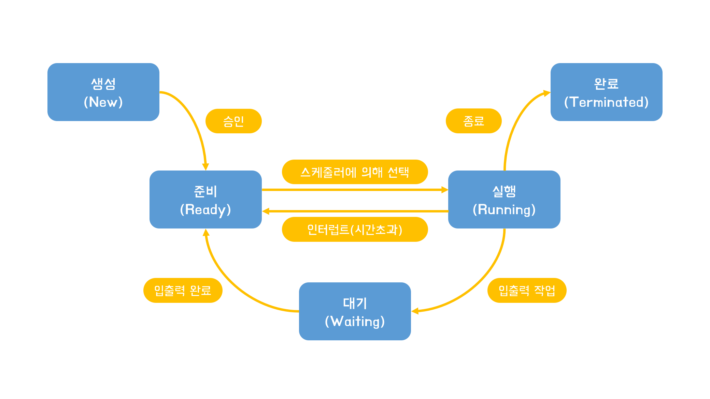

# 프로세스 상태

```
오늘날의 운영체제는 동시에 수많은 프로세스를 실행시킨다.
시분할 시스템을 사용하는 운영체제는 여러개의 프로세스들 돌아가며 실행시킨다.
즉, 동시에 실행되는 것이 아니라 매우 빠르게 여러 프로세스를 번갈아가며 실행시키기 때문에 동시에 실행되는 것 처럼 보이는 것이다.
```


1. 생성(New): PCB를 생성하고 메모리에 프로세스 적재를 요청한 상태
2. 준비(Ready): 메모리에 프로세스 적재가 허용되어 CPU를 사용하기 위해 기다리고 있는 상태, 대부분의 프로세스는 준비상태에 있음.
3. 대기(Waiting): 프로세스 입출력 요청시 입출력이 완료될 때 까지 기다리는 상태
4. 실행(Running): CPU스케줄러에 의해 CPU를 할당받아 실행되는 상태, 실행상태에 있는 프로세스의 수 = CPU의 개수, 할당된 시간이 지나면 준비상태로 돌아가게 됨.  
5. 완료(Terminated): 프로세스가 종료된 상태, 프로세스가 사용했던 데이터와 PCB를 메모리에서 제거
