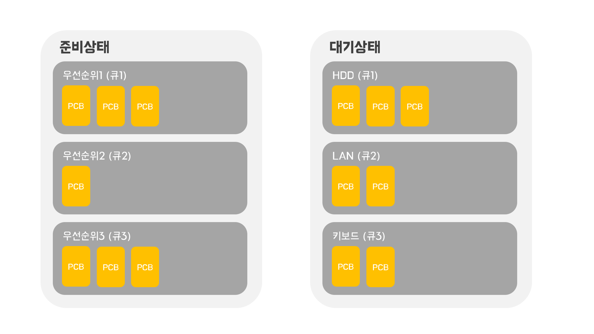

# 다중큐(Queue)

1. 프로세스가 실행상태에서 준비상태로 변경될 때 운영체제는 해당 프로세스의 우선순위를 보고 그에 맞는 준비 큐에 넣음.
2. CPU스케쥴러는 준비상태에 있는 다중큐의 프로세스들 중에서 적당한 프로세스를 선택해 실행상태로 전환시킴
3. 프로세스가 IO요청을 받아 대기상태가 되면 IO작업종류에 따라 분류된 각각의 큐에 들어가게 됨.
4. 정확히는 프로세스가 아닌 프로세스의 정보를 가지고 있는 PCB가 큐에 들어가게 됨.

