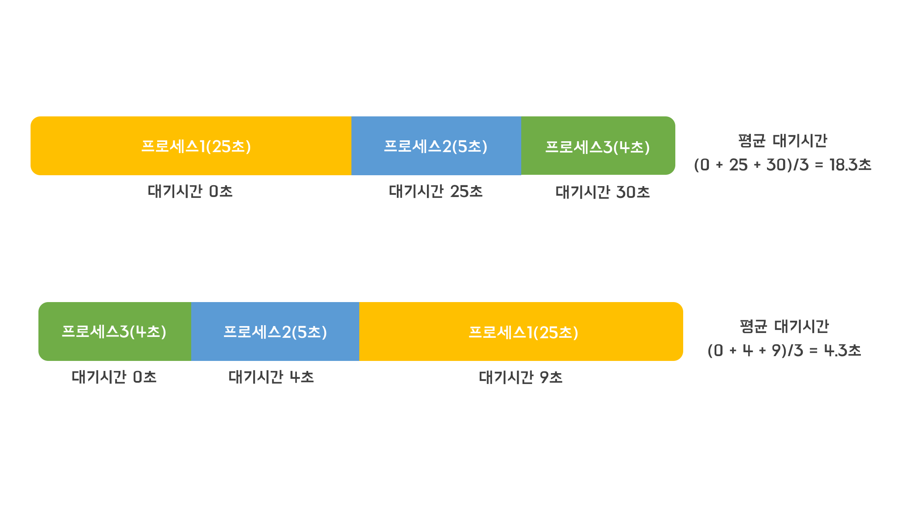

# FIFO(First-in-first-out)

* 먼저 들어온 프로세스가 먼저 실행되는 방식
* 장점: 단순하고 직관적
* 단점: 
  - 실행시간이 긴 프로세스가 먼저 실행될 경우 해당 작업이 끝날때까지 기다려야 함.
  - I/O작업이 있다면 I/O작업이 끝날때가지 기다려야 하기 때문에 CPU사용률이 떨어짐. 

> * 스케줄링의 성능은 평균 대기시간으로 측정한다.
 
> * 프로세스의 실행 순서만 변경했는데 평균 대기시간의 차이가 많이 나게 됨.
>   - FIFO 알고리즘은 프로세스의 Burst time에 따라 편차가 크기 때문에 현대 운영체제에서는 잘 쓰지 않고, 일괄처리 시스템에 쓰임.