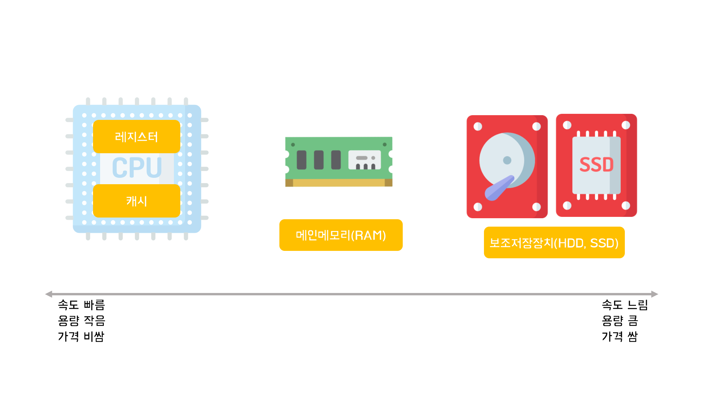

# 메모리의 종류

1. 레지스터
    - 가장 빠른 기억장소로 CPU내에 존재
    - 컴퓨터의 전원이 꺼지면 데이터가 사라지는 휘발성 메모리
    - 32, 64bit 크기로 나눠짐
    - 연산시 메인메모리의 값을 레지스터로 가져와 연산 후 다시 메모리로 전달

2. 캐시
    - 메인메모리에 있는 레지스터에 옮기기 전에 미리 저장해두는 곳
    - 성능을 위해 여러개의 캐시를 둠.(L1, L2, ..., Ln 캐시)

3. 메인메모리
    - 운영체제와 다른 프로세스들이 올라가는 공간
    - 휘발성

4. 보조저장장치
   - 비휘발성
   - 가격이 저렴하고 많은 용량을 저장할 수 있음