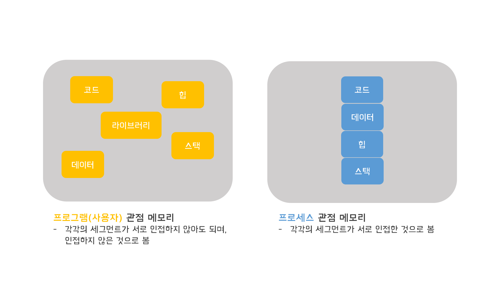
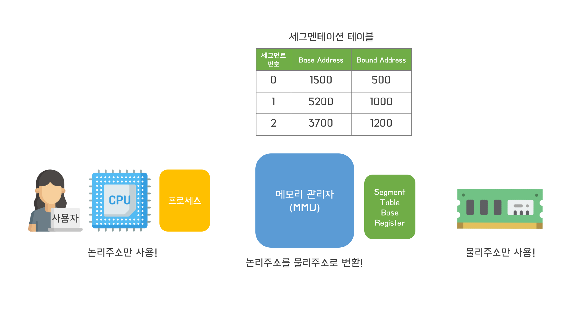

# 세그멘테이션(가변분할방식)

### 메모리관리자를 통한 논리주소 -> 물리주소 변환 과정

1. CPU가 논리주소를 메모리관리자에게 전달해주면 메모리관리자가 논리주소가 몇번째 세그먼트인지 알아낸다.
2. 메모리관리자 내의 Segment Table Base Register를 통해 물리메모리 내에 있는 세그멘테이션 테이블을 찾아낸다.
3. 세그먼트 번호를 인덱스로 Base Address와 Bound Address를 찾는다.
4. 메모리관리자는 CPU에게 전달받은 논리주소와 Bound Address의 값을 비교한다.
5. 논리주소가 Bound Address보다 작다면 Base Address와 논리주소의 값을 더해 물리주소로 변환한다.
6. 논리주소가 Bound Address보다 크다면 메모리 침범으로 간주하여 에러를 발생시킨다.

> 참고로 컨텍스트 스위칭시에 물리메모리 n번지 내에 있는 세그멘테이션의 값들도 변경된다.  
> 따라서 컨텍스트 스위칭은 굉장히 무거운 작업이다.