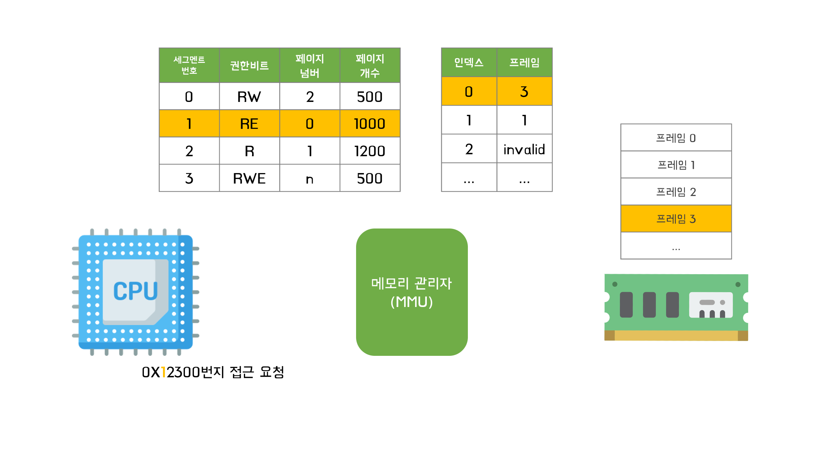

# 페이지드 세그멘테이션(배치 정책)

### 각 영역별 권한
- 코드 영역: 읽기/실행 권한
- 데이터 영역: 읽기/(쓰기) 권한
- 힙 영역: 읽기/쓰기 권한 
- 스택 영역: 읽기/쓰기 권한 

> 메모리 접근 권한에 대한 검사는 가상주소에서 물리주소로 변환될때마다 일어나는데,  
> 만약 권한을 위반한다면 메모리관리자가 에러를 발생시킨다.

### 메모리 관리자를 통한 논리주소 -> 물리주소 변환 과정

1. 가상주소를 이용해 몇번 세그먼트인지 알아낸다.
2. 세그멘테이션테이블에서 해당 번호를 인덱스로 참조하여 권한을 알아낸다.
3. 권한을 위반한 경우 에러를 발생시키고, 그렇지 않은 경우 페이지 넘버를 인덱스로 참조하여 페이지 테이블에서 프레임 번호를 찾는다.
4. 메모리에서 해당 프레임에 접근하여 물리주소에 페이지 개수를 더한다.

### 단점
- 논리주소를 물리주소로 변환하기 위해 메모리에 접근이 두번 필요함.
> 이러한 단점 때문에 현대 운영체제에서는 페이징과 페이지드 세그멘테이션 기법을 적절히 혼합하여 사용함.