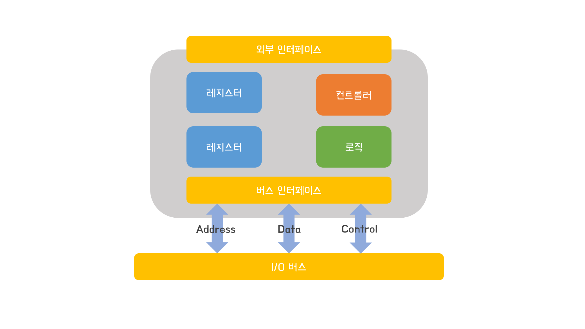

# 주변장치

- 그래픽카드, 하드디스트, 키보드, 마우스 등
- 주변장치들은 메인보드에 있는 버스로 연결

- 하나의 버스는 Address, Data, Control 버스로 이루어져 있음
- 각 하드웨어와 맞게 외부인터페이스가 존재
- 장치의 상태와 데이터를 보관할 수 있는 각종 레지스터 존재(입출력 작업시 데이터 저장)

### 캐릭터 디바이스 vs 블록 디바이스
- 데이터의 전송 단위가 캐릭터(글자)냐 블록이냐의 기준
- 캐릭터 디바이스: 
    - 1. 마우스, 키보드, 사운드카드, 직렬/병렬 포트 등
    - 2. 상대적으로 적은 양의 데이터 전송
- 블록 디바이스: 
  - 1. 하드디스크, SSD, 그래픽카드 등
  - 2. 상대적으로 많은 양의 데이터 전송

### 입출력 제어기
- 예전에는 주변장치들과 CPU를 하나의 버스로 연결하여 사용  
- 입출력 작업이 실행되면 CPU는 대기상태가 되어 CPU 사용률이 떨어지는 문제 발생  
- 이를 해결하기 위해 입출력 제어기 사용  
