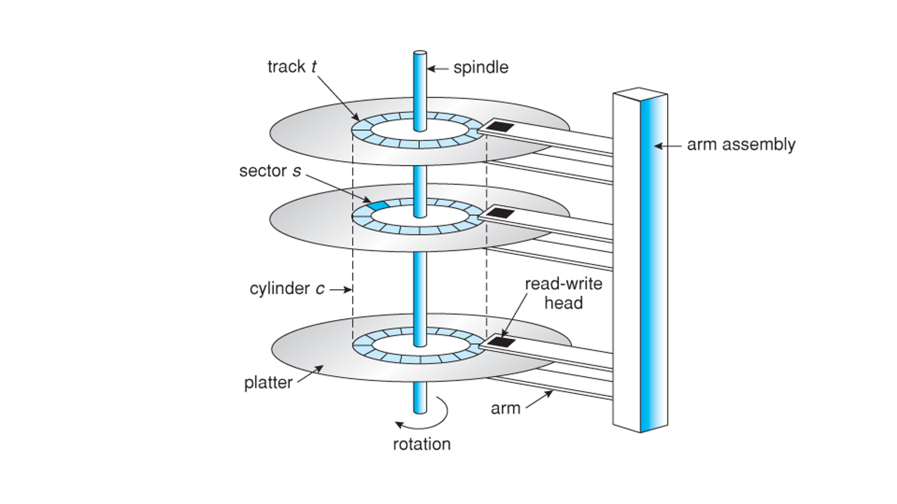

# 하드디스크와 플래시메모리

### 하드디스크(HDD)의 구조

1. spindle
2. platter
3. track
   - 보통 2개 이상으로 구성됨
   - 여러개의 섹터로 구성되어 있음
   - 플래터 내부에 있으며 자성을 띄고 있음
   - 표면이 N극을 띄면 0, S극을 띄면 1로 인식
4. sector
5. arm
   - 읽기/쓰기 헤드로 플래터의 표면을 읽음
5. read-write head 
   - 디스크암에 고정되어 있기 때문에 모든 헤드는 항상 같이 움직임.
6. cylinder
   - 여러개의 플래터에 있는 같은 트랙의 집합

### 하드디스크에서 데이터를 읽는 방법
- 유저프로세스에서 요청을 보냄
- "실린더 C로 가서 트랙 B에 있는 섹터 D를 읽어라"
- 디스크암이 헤드를 C로 이동(seek), 소요시간(seek time) 은 ms 단위이기 때문에 다른 전자장치(ns 단위)에 비해 상당히 느린 것처럼 느껴짐.
- 트랙B의 섹터D가 헤드에 닿을때까지 스핀들을 이동시킴.
- 헤드에 섹터D가 읽히면 작업 종료

### 플래시메모리(SSD)
- 기계적으로 데이터를 읽는 하드디스크에 비해 전기적으로 데이터를 읽기 때문에 빠르고 조용함.
- 자석에 손상되는 하드디스크와 달리 자성으로 데이터가 손상되지 않음.
- 스핀들같은 회전축이 없기 때문에 충격에 강함
- 그러나 특정한 지점에 데이터를 썼다면 덮어쓰기가 불가능, 기존의 데이터를 지우고 다시 써야 하는데 삭제가능횟수가 정해져있음.

