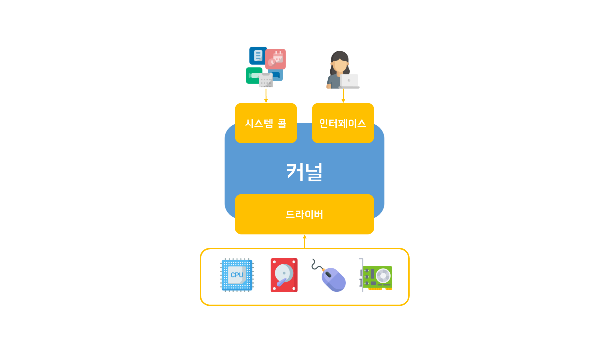

# 운영체제의 구조

1. 커널
 - 운영체제의 핵심 요소
 - 사용자는 커널에 직접 접근할 수 없고 인터페이스를 통해서만 접근할 수 있음
 - 어플리케이션은 시스템 콜을 이용하여 커널에 접근할 수 있음.

2. 인터페이스
 - GUI(Graphic user interface): 말 그대로 그래픽을 통하여 사용하는 인터페이스로 사용자가 이해하기 쉬움.
 - CLI(Command line interface): 텍스트를 이용해 커널과 상호작용하는 인터페이스

3. 시스템 콜(인터페이스)
 - 어플리케이션이 커널에 직접 접근하는것을 방지하기 위하여 시스템 콜(인터페이스) 제공
 - 파일 저장시 Write라는 함수를 호출하면 운영체제가 빈 공간을 찾아 저장해줌.
 - 심화: 시스템 프로그래밍

4. 드라이버
 - 하드웨어를 위해 제공하는 인터페이스.
 - 하드웨어는 종류가 다양하기 때문에 운영체제에 모든 드라이버를 탑재하기 불가능.
 - 따라서 드라이버는 보통 하드웨어 제조사에서 제공하지만 키보드나 마우스와 같은 기본적인 장치들은 커널에 포함되어 있음.
